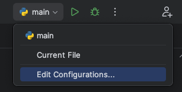
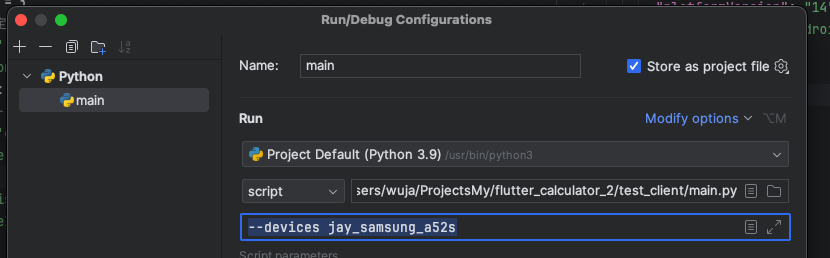

# Test Client

## Get Started

參考 [nvm Github 頁面](https://github.com/nvm-sh/nvm)，照著安裝

```shell
brew install allure
npm -g install appium
```

For iOS

```shell
brew install ideviceinstaller
appium driver install xcuitest
appium driver install uiautomator2
appium plugin install images
# appium driver list
# appium driver uninstall xcuitest || true
```

### iOS

```shell
appium driver install xcuitest
npm install -g ios-deploy
```

### Setup

- 根據 `appium_sample.json` 建立 `appium.json`

## Notes

### Capabilities

Android

- `deviceName`: 透過指令 `adb devices` 取得
- `platformVersion`: Android 版本，透過指令 `adb shell getprop ro.build.version.release` 取得
- `platformName`: `Android`

iOS

- 設定裝置（擇一）
  - `deviceName`: 透過指令 `xcrun xctrace list devices` 取得
  - `udid`: 如果只有連接一台實體機，可設定為 `auto`；透過指令 `instruments -s devices` 取得
- 設定 App (擇一)
  - `bundleId`: 已安裝好的可以直接指定，例： `com.example.flutterCalculator2`
  - `app`: ipa 的檔案路徑，需用絕對路徑，例：`/Users/wuja/Downloads/flutter_calculator_2.ipa`
  - 模擬器要用 bundleId，實體機可以用 bundleId 或 app
    > from [Source](https://discuss.appium.io/t/unable-to-launch-ios-app-using-ipa-file/20810/2)
    > 
    > IPA file is build for ARM architecture (iDevice). Simulator runs on x86 architecture (Your Mac) so you need to compile for that. You won’t need to compress into .ipa format, so .app is fine. You’ll probably want to bring this up with the developers. You need a Debug build for Simulator. Here is some instruction that may help:
- 其他
  - `xcodeOrgId`: Team ID (可在[這邊](https://developer.apple.com/account/#/membership)查)
  - `usePrebuiltWDA`: 是否使用預先建立的 WebDriverAgent
  - `useNewWDA`: 強制移除原本的 WebDriverAgent

> 一些注意事項:
> 
> - 裝置的 udid 需註冊 (ref: [How to add UDID to Apple Developer Account?](https://developer.apple.com/account/resources/devices/list))
> - [appium-xcuitest-driver](https://github.com/appium/appium-xcuitest-driver/tree/master/docs)

Ref

- [appium-xcuitest-driver/capabilities](https://appium.github.io/appium-xcuitest-driver/4.16/capabilities/) 

### Flutter

#### iOS

1. Run: `flutter build ios --release`
2. Go to Xcode -> select Any iOS Device
3. Select product -> archive
4. Once done, In the popup dialog, select distribute then select Adhoc (Install on designated devices) then click next
5. On the next page, select none for app thinning then click next
6. Select automatically manage signing then click next or manually manage signing if you want to change the provisioning profile then, click next
7. Click export, then select the desired location you want to save the ipa then click export.
8. Once done, where you exported to should have the ipa. You can upload this ipa to firebase app distribution or where neccessary.

### 指定 Capabilities





如果有多台，以 `,` 區分，例： `--devices simulator_iphone_15_pro_max,jay_samsung_a52s`

## References

- [PyTest Testing Framework](https://www.youtube.com/playlist?list=PLsjUcU8CQXGECu4Sl1IwrguGRU0iQGt3E)
- [在 iOS 實體機上執行 appium](https://appium.readthedocs.io/en/stable/cn/appium-setup/real-devices-ios/)
- [How to create ipa file in flutter for testing purpose?](https://stackoverflow.com/questions/58724420/how-to-create-ipa-file-in-flutter-for-testing-purpose)
- [Appium Desired Capabilities](https://appium.readthedocs.io/en/stable/en/writing-running-appium/caps/)
- [appium-setup/real-devices-ios](https://appium.readthedocs.io/en/stable/cn/appium-setup/real-devices-ios/)
